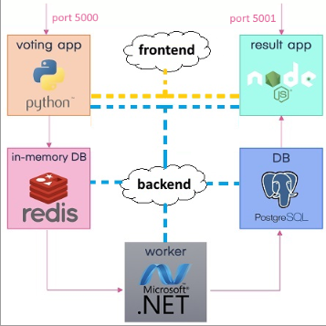

# 09.Blue vs Green App

> Simple voting app, which you should run with Docker Compose.

> It provides an interface for a user to vote and another interface to show the results. You can vote and then change your vote and this will make changes in the results.

>Your task is to fill in the missing instructions in the Dockerfiles and run the app with Docker Compose.

> The app has the following architecture: 

> And consists of:
01. A voting app – a Web app, developed in Python, which provides an interface for the user to choose between two options (blue and green) 

02. An in-memory database on Redis, which stores the user's vote from the voting app 

03. A worker app on .NET, which processes the new vote by updating the persistent database 

04. A persistent PostgreSQL database, which has a single table with the number of votes for each category (blue and green) 

05. A NodeJS Web interface (app), which displays the result of the votes from the PostgreSQL database 

## Requirements

>Use the latest images for PostgeSQL and Redis from Docker Hub and use the filled-in Dockerfiles for the voting, result and worker app 

>PostgreSQL container needs user and password for login: see how to set them in the image's documentation 

>The voting app should be accessed on localhost:5000 and the result app – on localhost:5001 

>Network traffic should be separated to two networks – frontend and backend: 

>The frontend network is for the users' traffic. Connect the voting app and the result app to it 

>The backend network is for the traffic within the app. It connects all app components 

>Run the voting and result apps in the containers 

>Use volumes for the voting and result apps and the db container 

### [Vote-app: Python dockerfile](./Blue-VS-Green-App/vote/Dockerfile)

### [Worker-app: .NET dockerfile](./Blue-VS-Green-App/worker/Dockerfile)

### [Result-app NodeJS dockerfile](./Blue-VS-Green-App/result/Dockerfile)

### [Docker-Compose file](./Blue-VS-Green-App/docker-compose.yml)