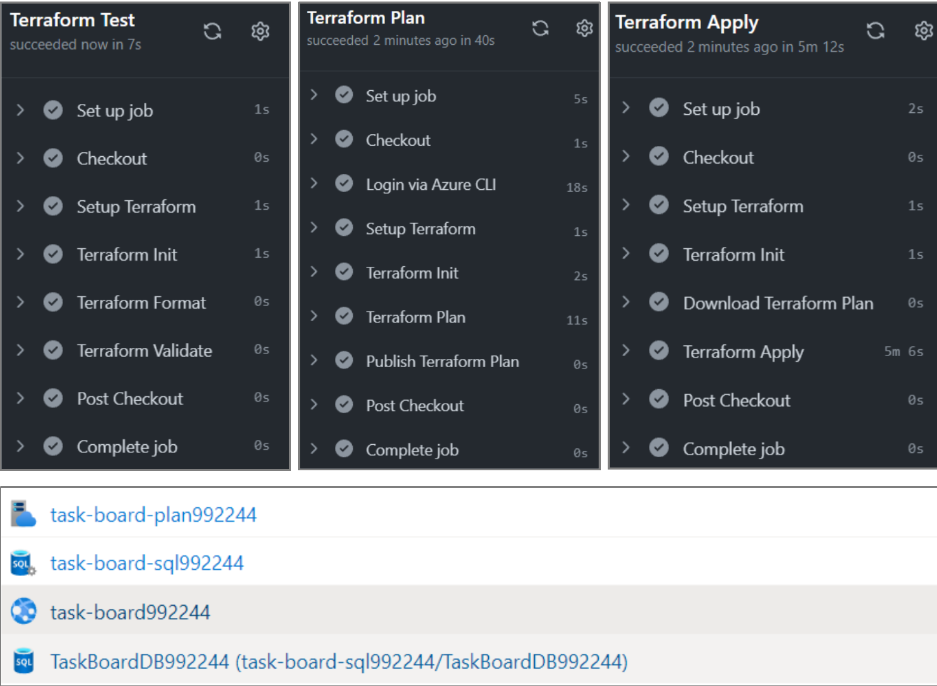

# Terraform with CI/CD

# [link to task repo](https://github.com/denidim/Terraform-CI-CD-GitHub-Actions-Azure)

>## Now we will upload the Terraform configuration from the previous task (for provisioning Azure resources and deploying the "TaskBoard" Web app to Azure Web Apps) to GitHub and will use GitHub Actions workflows to test and run the configuration.

>### By combining Terraform with GitHub Actions, we can automate the infrastructure provisioning process, ensure consistency, and integrate it into your CI/CD workflows, promoting efficient software delivery and reducing manual tasks. It provides a streamlined and efficient workflow for managing infrastructure as code, making it easier to maintain, test, and deploy your infrastructure resources.

>#### We will have GitHub Actions workflows that will provision the Azure resources we want:



>#### Test Workflow

We will first write a test workflow in GitHub Actions that will try to initialize the working directory, check if the configuration files are correctly formatted and validate the configuration.

``` yml
# YAML file in GitHub Actions
on:
  push:
  workflow_dispatch:

jobs:
  terraform-test:
    name: 'Terraform Test'
    runs-on: ubuntu-latest

    steps:
    # Checkout the repository to the GitHub Actions runner
    - name: Checkout
      uses: actions/checkout@v3
        
    # Install the latest version of the Terraform CLI
    - name: Setup Terraform
      uses: hashicorp/setup-terraform@v2
      with:
        terraform_wrapper: false

    # Initialize a new or existing Terraform working directory 
    # Creating initial files, loading any remote state, downloading modules, etc.
    - name: Terraform Init
      run: terraform init

    # Checks that all Terraform configuration files adhere to a canonical format
    - name: Terraform Format
      run: terraform fmt -check -recursive
      
    # Validate Terraform files
    - name: Terraform Validate
      run: terraform validate

```