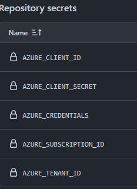
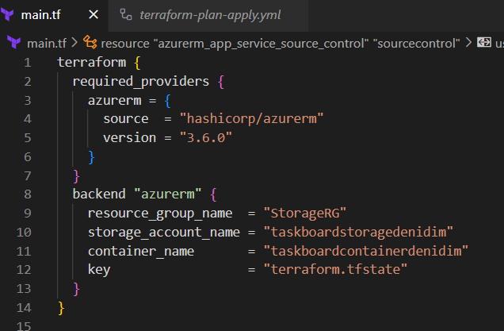

# Terraform with CI/CD

# [link to task repo](https://github.com/denidim/Terraform-CI-CD-GitHub-Actions-Azure)

>## Now we will upload the Terraform configuration from the previous task (for provisioning Azure resources and deploying the "TaskBoard" Web app to Azure Web Apps) to GitHub and will use GitHub Actions workflows to test and run the configuration.

>### By combining Terraform with GitHub Actions, we can automate the infrastructure provisioning process, ensure consistency, and integrate it into your CI/CD workflows, promoting efficient software delivery and reducing manual tasks. It provides a streamlined and efficient workflow for managing infrastructure as code, making it easier to maintain, test, and deploy your infrastructure resources.

>#### We will have GitHub Actions workflows that will provision the Azure resources we want:


>#### Test Workflow

``` yml
# YAML file in GitHub Actions
on:
  push:
  workflow_dispatch:

jobs:
  terraform-test:
    name: 'Terraform Test'
    runs-on: ubuntu-latest

    steps:
    # Checkout the repository to the GitHub Actions runner
    - name: Checkout
      uses: actions/checkout@v3
        
    # Install the latest version of the Terraform CLI
    - name: Setup Terraform
      uses: hashicorp/setup-terraform@v2
      with:
        terraform_wrapper: false

    # Initialize a new or existing Terraform working directory 
    # Creating initial files, loading any remote state, downloading modules, etc.
    - name: Terraform Init
      run: terraform init

    # Checks that all Terraform configuration files adhere to a canonical format
    - name: Terraform Format
      run: terraform fmt -check -recursive
      
    # Validate Terraform files
    - name: Terraform Validate
      run: terraform validate

```

>#### Step 1: Create Service Principal

``` powershell
az ad sp create-for-rbac --name "Azure-Terraform-GitHub-Actions-DeniDim" --role contributor --scopes /subscriptions/************** --sdk-auth
```

>#### Step 2: Create GitHub Secrets



>#### Step 3: Write the Workflow

``` yml
# YAML file in GitHub Actions
name: 'Terraform Plan And Apply'

on:
  push:
  workflow_dispatch:

env:
  ARM_CLIENT_ID: ${{ secrets.AZURE_CLIENT_ID }}
  ARM_CLIENT_SECRET: ${{ secrets.AZURE_CLIENT_SECRET }}
  ARM_SUBSCRIPTION_ID: ${{ secrets.AZURE_SUBSCRIPTION_ID }}
  ARM_TENANT_ID: ${{ secrets.AZURE_TENANT_ID }}

jobs:
  terraform-plan:
    name: 'Terraform Plan'
    runs-on: ubuntu-latest

    steps:
    # Checkout the repository to the GitHub Actions runner
    - name: Checkout
      uses: actions/checkout@v3

    # Login to Azure via Azure CLI
    - name: Login via Azure CLI
      uses: azure/login@v1
      with:
        creds: ${{ secrets.AZURE_CREDENTIALS }}
        
    # Install the latest version of the Terraform CLI
    - name: Setup Terraform
      uses: hashicorp/setup-terraform@v2
      with:
        terraform_wrapper: false

    # Initialize a new or existing Terraform working directory
    # Creates initial files, loading any remote state, downloading modules, etc.
    - name: Terraform Init
      run: terraform init
      
    # Generates an execution plan for Terraform
    - name: Terraform Plan
      id: tf-plan
      run: terraform plan -out tfplan
        
    # Save plan to artifacts  
    - name: Publish Terraform Plan
      uses: actions/upload-artifact@v3
      with:
        name: tfplan
        path: tfplan
                
  terraform-apply:
    name: 'Terraform Apply'
    runs-on: ubuntu-latest
    needs: [terraform-plan]
    
    steps:
    # Checkout the repository to the GitHub Actions runner
    - name: Checkout
      uses: actions/checkout@v3

    # Install the latest version of Terraform CLI
    - name: Setup Terraform
      uses: hashicorp/setup-terraform@v2

    # Initialize a new or existing Terraform working directory
    # Creates initial files, loading any remote state, downloading modules, etc.
    - name: Terraform Init
      run: terraform init

    # Download saved plan from artifacts  
    - name: Download Terraform Plan
      uses: actions/download-artifact@v3
      with:
        name: tfplan

    # Terraform Apply
    - name: Terraform Apply
      run: terraform apply -auto-approve tfplan

```

We successfully used GitHub Actions to run a Terraform configuration that provisions resources in Azure. However, if we change the configuration and run the workflow again, an error will occur. This happens because we don't save the Terraform configuration state file.

## Store State File in Azure Storage Account

> Terraform utilizes a state file to store information about the current state of your managed infrastructure and associated configuration. This file will need to be persisted between different runs of the workflow.

> The recommended approach is to store this file within an Azure Storage Account

``` powershell
az storage account create --name taskboardstoragedenidim --resource-group StorageRG --location northeurope --sku standard_LRS --kind StorageV2

az storage container create -n taskboardcontainerdenidim --account-name taskboardstoragedenidim
```

> to use this storage in Terraform, you should add a backend block in the main.tf configuration

